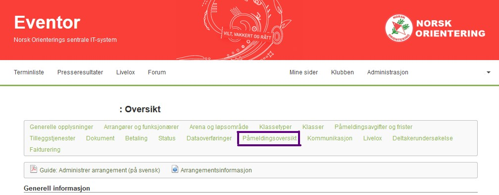
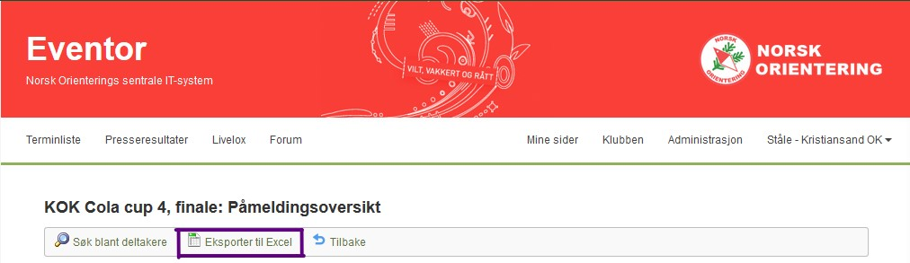

# pyeventor2ttime

## About

A script to convert entries from [Eventor](https://eventor.orientering.no) to the [ttime](http://ttime.no/) database format.

The [ttime](http://ttime.no/) application for Windows is used for timekeeping and entries during orienteering events with [emit](https://emit.no) eCards. Versions up to 0.72 had problems with SSL authentication, and it was not possible to pull entries from the [Eventor](https://eventor.orientering.no) platform to ttime. This program is written to make that transition easier.

Version 0.73 has fixed the SSL issues, so **this program is superflous**.

## Downloading entries from Eventor

Go to [eventor.orientering.no](https://eventor.orientering.no) and log in. Find your race and click `Edit` to change the race preferences. You need to have at least Event organizer privileges in your club to be able to access these preferences.

You now have two options for exporting your data: as an [IOF XML 3.0](https://orienteering.sport/iof/it/data-standard-3-0/) file or as an [Excel 2003 XML format](https://docs.microsoft.com/en-us/previous-versions/office/developer/office-xp/aa140066(v=office.10)?redirectedfrom=MSDN) format file. The IOF XML format is widely supported by different kinds of orienteering software, while the Excel 2003 XML format has the advantage that you can easily manipulate the data by using the Microsoft Excel.

The procedures for downloading both kinds of file formats are given below.

### Download IOF XML 3.0 data from Eventor

- Go to `Data exchange`
- Choose the `xml` option by the text "Export entries"

### Download Eventor Excel 2003 XML

Go to entry overview. See the image below.


Download the entries as an Excel document.


## Usage

The program can be run as a python script or as a standalone Windows program. The Windows executable file is easier to use, but it is quite large (approx. 225 MB), and also quite a bit slower than the python script.

The python script can be downloaded from the repository above. The Windows .exe file can be found under [releases](https://github.com/stalegjelsten/pyeventor2ttime/releases).

You can either run the python file `pyeventor2ttime.py` or the Windows executable file `pyeventor2ttime.exe`. The python file requires the packages `pandas`, `beautifulsoup4` and possibly `lxml` to run. Usage:

```bash
python pyeventor2ttime.py "Entry overview XXXXX.xls"
```

The python file can also be called without any argument (i.e. without a file name), in which case it will open a system dialog box, asking for the file name.

The Windows executable file is quite easy to use -- just download the file and open it. It will take some time to start up, since it needs to unpack all the python code and modules to a temporary directory on your hard drive. This can take anywhere from 10 seconds to a few minutes. Please be patient. You can cancel the program by pressing Ctrl + C during execution. Once the Select file dialog box opens up, navigate to your .xls or .xml file. The output file will be stored in the directory of the `pyeventor2ttime.exe` file.

## FAQ

Q: What about entries without emit ecards?  
A: Those entries are given no ecard number or number 999

Q: The script has a bug.  
A: Please open an issue here on GitHub

Q: I have a problem with the script.  
A: Send me a personal message here on GitHub or by email
